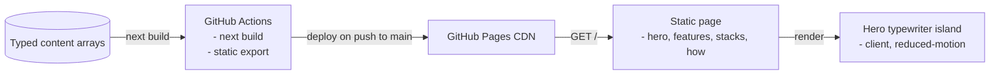
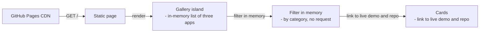
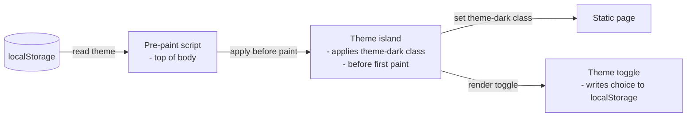
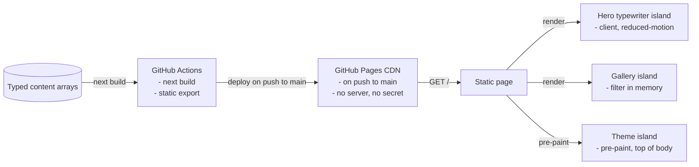

# Platform Site System Design

[](https://github.com/elleskay/platform-site/actions/workflows/deploy.yml)
[](https://github.com/elleskay/platform-site/actions/workflows/ci.yml)

> A system design breakdown of the marketing and showcase site for two open-source app templates, [**platform**](https://github.com/elleskay/platform) (web) and [**mobile-platform**](https://github.com/elleskay/mobile-platform) (mobile). It explains what the templates give an AI coding agent, and proves it with a filterable gallery of three real apps that are live right now.
>
> **Live** at https://elleskay.github.io/platform-site

---

## Understanding the Problem

This is a brochure, not an application. There are no users to authenticate, no data to store, and nothing to compute on a request. The job is to explain the templates clearly, look credible, and link out to three live demos and their repos.

That sounds trivial, and the content is. The interesting constraints are all in the delivery. The site has to serve as pure static files so it costs nothing and never goes down, it has to render correctly both at a local root and under a GitHub Pages repo subpath, it has to remember a light or dark theme without flashing the wrong one on load, and a push to the repo has to redeploy it with no human in the loop. So the design problem is "ship a fast, free, self-deploying static site that behaves correctly under a subpath," not "serve scale" or "model a domain."

### Functional Requirements

- A visitor should be able to read what the templates offer: the features, the wired technologies, and how the build flow works.
- A visitor should be able to browse a gallery of the real apps built on the templates, filter it by category, and open any live demo or its repo.
- A visitor should be able to switch between a light and a dark theme and have that choice remembered on the next visit.
- A visitor should see an animated illustration of prompting a coding agent to build an app.

Out of scope: no accounts, no backend, no database, no server-side compute. It is a static site.

### Non-Functional Requirements

- The site should be servable as pure static files, so hosting is free and there is nothing to keep running.
- The chosen theme should apply before first paint, with no flash of the wrong theme.
- Asset and image links must resolve correctly whether the site is served from the root locally or under the `/platform-site` repo subpath in production.
- A push to the main branch should rebuild and redeploy automatically.
- Pages should be fast: prebuilt HTML on a CDN, with no layout shift as images load.
- No secrets anywhere, since the whole thing is public and static.

---

## The Set Up

### Planning the Approach

The whole site is one Next.js project exported to static HTML, CSS, and JavaScript. There is no server at request time. Content lives in source as typed arrays, the page renders from them at build, and the only runtime behavior is three small client islands: the hero typewriter, the gallery filter, and the theme toggle. GitHub Pages serves the exported files from its CDN, and a workflow rebuilds on every push to main. Because the output is static, the design is about correct paths, no-flash theming, and a clean deploy, not infrastructure.

### Defining the Core Entities

There is no database. The content is the data, held in typed arrays in the source and rendered at build time.

- **App showcase**, the list of three live apps with name, category, blurb, live URL, repo URL, and screenshot.
- **Capability content**, the feature cards, the wired technology stacks, and the build-flow steps.
- **Theme**, light or dark, the visitor's choice, held in browser localStorage.
- **Selected category**, the active gallery filter, held in client state for the session.

### API or System Interface

There is no API. The site is static files served over HTTP, plus file-based metadata images.

The single page route serves the one statically exported HTML document at the site root, the landing page that stitches together every section (hero, features, stacks, how, gallery, CTA). Because the whole site is a single page, this one route is the entire public surface a visitor ever requests.

```
GET /  -> the single exported page (hero, features, stacks, how, gallery, CTA)
```

The file-based metadata routes are images the framework emits as static files at build time from convention-named source files, one per social and icon use (Open Graph card for link unfurls, favicon for the browser tab, Twitter card for tweet previews). Each is a fixed asset on the CDN, not a function, so a request just returns the prebuilt image.

```
GET /opengraph-image  -> Open Graph card (file-based metadata route)
GET /icon             -> favicon (file-based metadata route)
GET /twitter-image    -> Twitter card (file-based metadata route)
```

Everything is prebuilt at deploy time and served from the GitHub Pages CDN.

---

## High-Level Design

We build the design one functional requirement at a time.

### 1) A visitor reads what the templates offer

The page is composed from typed content arrays: feature cards, a grid of eight wired technologies, and a five-step build flow. A hero shows two animated terminal mockups typing realistic agent prompts (one web, one mobile), built as a client typewriter that respects reduced-motion. All of it is server-rendered to static HTML at build time.

We start with content to a static page: typed arrays render to HTML at build time, with the hero typewriter as the first client island.



### 2) A visitor browses and filters the showcase

The gallery is a client island holding the three apps as a static in-module list. Category buttons set client state and filter the list instantly, with no navigation and no request. Each card links straight to the live demo and the repo, and screenshots use the framework image component with blur placeholders and fixed aspect boxes so nothing shifts as they load.

We add the second client island: the gallery, filtering an in-memory list with no request.



### 3) A visitor switches theme and it sticks

A small inline script at the top of the document body reads the saved theme from localStorage and applies the theme-dark class before first paint, so there is no flash. A toggle button flips the class and writes the new choice back to localStorage. Light is the default when nothing is saved.

We add the third client island: the theme, applied before first paint from localStorage. That completes the client-side picture.



---

## Potential Deep Dives

### 1) How do we serve it cheaply and keep it always up?

A marketing page that runs a server is a liability: it costs money, it can fall over, and it needs patching.

<details>
<summary><strong>Bad solution: run a server to render a brochure</strong></summary>

Host the site on a long-running server or a serverless function that renders on each request. For a page whose content only changes when the repo does, that is pure overhead: a bill, a thing to monitor, and a thing that can go down.
</details>

<details>
<summary><strong>Good solution: a container or VM serving prebuilt files</strong></summary>

Build once and serve the files from a small always-on host. Better, but you still run and pay for a host, and you still own its uptime and patching for content that is effectively frozen between deploys.
</details>

<details>
<summary><strong>Great solution: fully static export on a CDN</strong></summary>

Export the whole site to static HTML, CSS, and JavaScript and serve it from the GitHub Pages CDN. There is no server, no bill, no key, and nothing to keep alive. It is fast everywhere and effectively always up. This is what the site runs.
</details>

### 2) How do we make links work both locally and under a repo subpath?

In production the site lives under `/platform-site`, but locally it is easier to serve from the root, and the asset paths have to be right in both.

<details>
<summary><strong>Bad solution: hardcode paths for one environment</strong></summary>

Write absolute paths assuming either the root or the subpath. One environment works and the other breaks: assets and images 404 either in local preview or in production.
</details>

<details>
<summary><strong>Good solution: always build with the subpath</strong></summary>

Set the base path to `/platform-site` everywhere. Production is correct, but local preview now has to be served under that same subpath, which is awkward and easy to get wrong.
</details>

<details>
<summary><strong>Great solution: an env-switchable base path</strong></summary>

Read the base path from one `PAGES_BASE` environment variable: the deploy workflow sets it to `/platform-site`, and local dev and preview leave it unset and default to the root. Both environments resolve assets correctly, and nothing depends on exporting an empty variable, which some shells cannot even express. Set the metadata base to the origin only, since the framework already prefixes the subpath onto file-based image routes, which avoids doubling it on the Open Graph card. This is what the site runs.
</details>

### 3) How do we apply the saved theme with no flash?

A static page paints as soon as the HTML arrives, before any React runs, so a theme applied in a component lands a beat too late.

<details>
<summary><strong>Bad solution: set the theme in a React effect after hydration</strong></summary>

Read the saved theme in a client effect and toggle the class then. The page first paints in the default theme and then snaps to the saved one, a visible flash on every load.
</details>

<details>
<summary><strong>Good solution: follow the OS preference with CSS only</strong></summary>

Use a CSS media query to match the operating system theme. No flash, but it ignores the visitor's explicit choice on this site, so the toggle cannot actually override the OS.
</details>

<details>
<summary><strong>Great solution: persist the choice and apply it before paint</strong></summary>

Save the chosen theme to localStorage, and run a tiny inline script at the top of the document body that reads it and sets the theme-dark class before first paint. The toggle writes the choice back. The visitor's explicit choice wins, and there is no flash. This is what the site runs.
</details>

### 4) How do we filter the showcase without a backend?

Visitors want to narrow the gallery by category, but there is no server to query.

<details>
<summary><strong>Bad solution: a page per category</strong></summary>

Pre-render a separate page for each category and link between them. Every filter change is a full navigation and reload, which feels heavy for flipping a tag on three cards.
</details>

<details>
<summary><strong>Good solution: a query parameter and reload</strong></summary>

Encode the category in the URL and re-render on change. Shareable, but each click still reloads the page for a purely visual filter.
</details>

<details>
<summary><strong>Great solution: client-side filter over a static list</strong></summary>

Hold the three apps as a typed in-module list and filter them in client state, so changing category is instant with no navigation and no request. The list is tiny, so there is nothing to paginate or fetch. This is what the site runs.
</details>

### 5) How do we keep images fast on a host with no image server?

GitHub Pages serves files, it does not optimize images on the fly, and large screenshots can both bloat the page and shift the layout as they load.

<details>
<summary><strong>Bad solution: drop in full-size images raw</strong></summary>

Reference the screenshots at full size with plain tags. Pages load heavy, and each image pops in and shoves the layout as it arrives.
</details>

<details>
<summary><strong>Good solution: hand-resize every screenshot</strong></summary>

Manually compress and size each image. It helps, but it is tedious to maintain and still does nothing about layout shift or low-quality placeholders while the file downloads.
</details>

<details>
<summary><strong>Great solution: the image component, unoptimized, with blur and fixed boxes</strong></summary>

Use the framework image component in unoptimized mode (there is no image server on Pages), with build-time blur placeholders, size hints, and fixed aspect-ratio boxes. Images fade in over a blur with zero layout shift, and nothing needs a server. This is what the site runs.
</details>

---

## The complete design

Pulling the high-level design and the deep dives together, here is the whole system in one view. It deploys as static files on the GitHub Pages CDN, rebuilt and published by a workflow on every push to main, with no server and no secret.



## Running it locally

Use the Node version in `.nvmrc` (24), then:

```bash
npm install
npm run dev        # dev server at http://localhost:3000
npm run lint       # ESLint (next/core-web-vitals + next/typescript)
npm run typecheck  # next typegen, then tsc --noEmit
npm run build      # static export to out/
npx serve out      # preview the exported site
```

Local builds default to a root base path. CI sets `PAGES_BASE=/platform-site` so the deployed site resolves assets under the GitHub Pages subpath.

## Tech stack

| Layer | Tech |
|---|---|
| Framework | Next.js 15.5 (App Router), static export, React 19, TypeScript strict |
| Styling | Tailwind CSS v4, CSS variables for theming |
| Icons | Simple Icons for the brands that license free reuse, hand-drawn marks for the rest |
| Fonts | Inter and JetBrains Mono via the framework font loader |
| Client islands | hero typewriter, gallery filter, and theme toggle, everything else is static |
| Hosting | GitHub Pages CDN, served under the platform-site subpath |
| Deploy | GitHub Actions on push to main: lint, typecheck, build, then publish to Pages; pull requests run the same checks without deploying |
| Dependencies | Dependabot, weekly grouped updates for npm and GitHub Actions |

## License

MIT.
